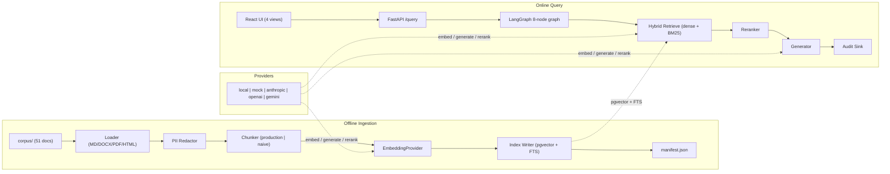
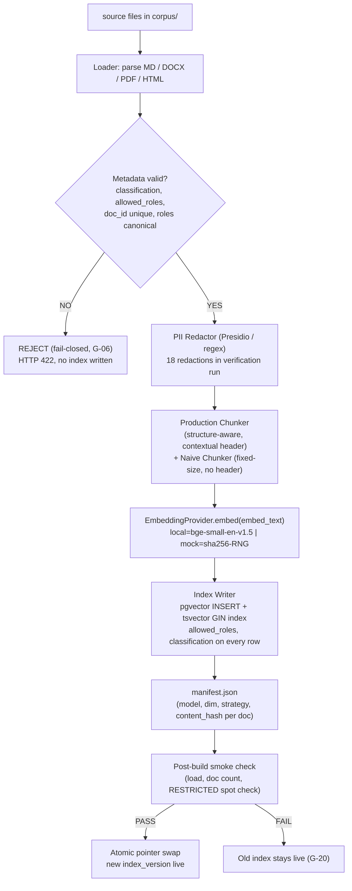
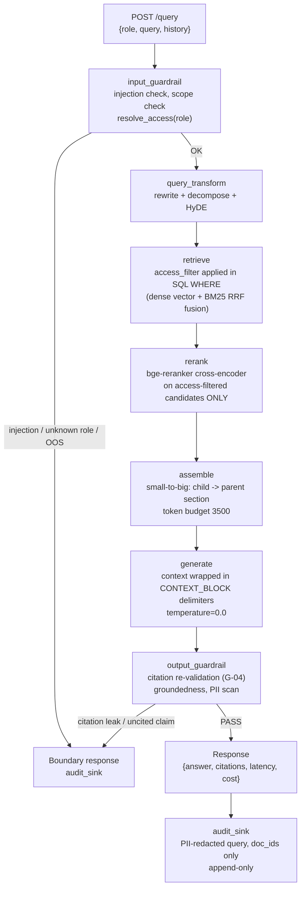
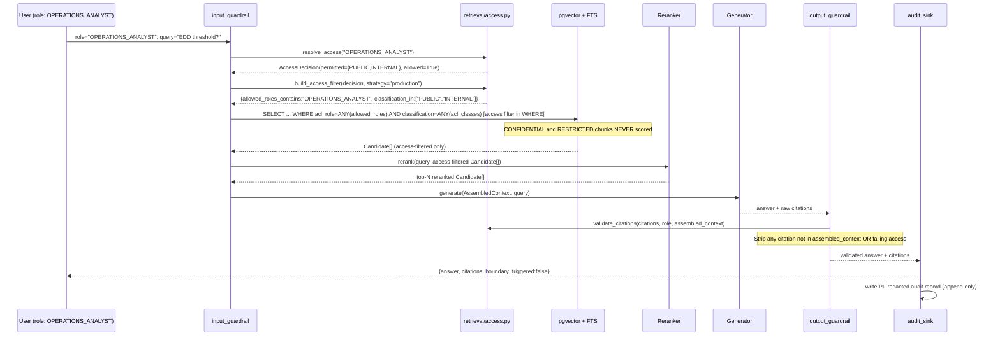
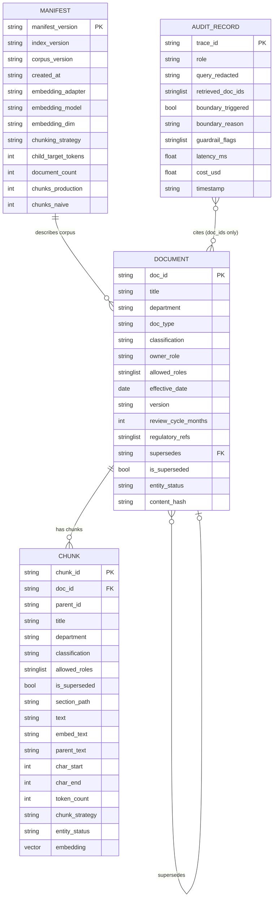
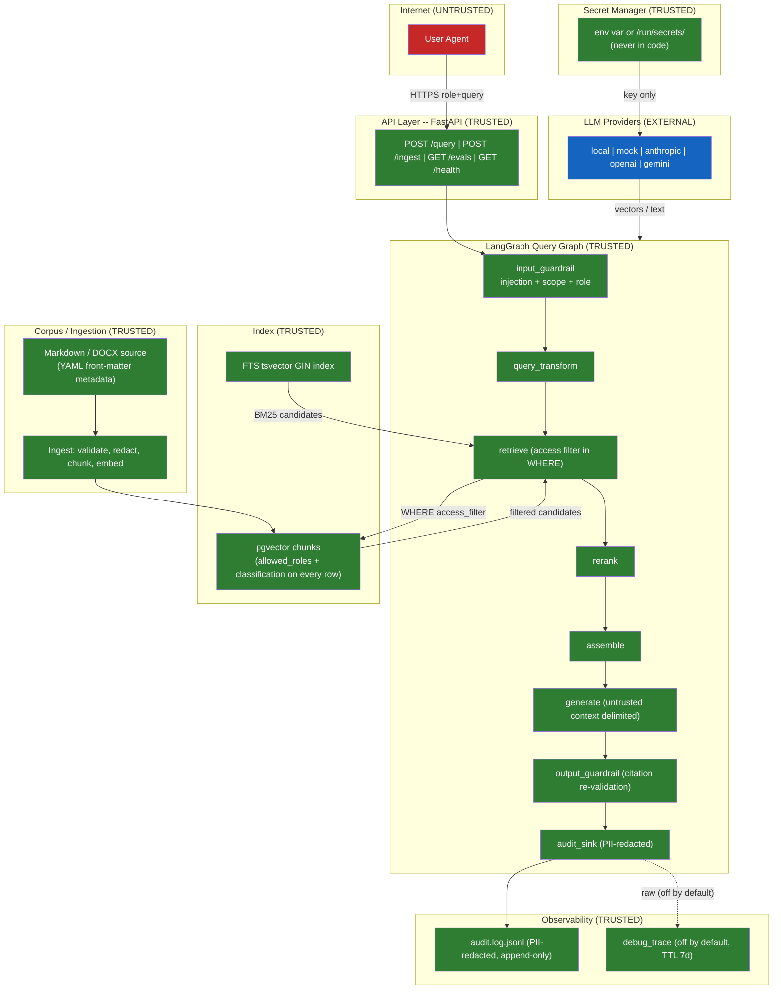

# **FICTIONAL COMPANY: Meridian John Doe Financial does not exist.**
# This is a portfolio demonstration. "John Doe" is in the name intentionally.
# See NOTICE.md for the full disclaimer.

---

# Meridian J.D. RAG

**Created: 2026-06-29**
**Last updated: 2026-06-29**

A retrieval-augmented generation system where access control is enforced in the SQL `WHERE` clause before any chunk is scored: so a `COMPLIANCE_OFFICER` and a `BRANCH_STAFF` member asking the same question get different answers, and the boundary is verified by an automated access-control proof battery that runs in CI.

## TL;DR

This is a RAG system built on Postgres + pgvector with a LangGraph query pipeline, 51 synthetic financial policy documents across 7 departments and 4 classification levels, and a CI eval gate that asserts security metrics deterministically without API keys. The design decision worth explaining is the placement of access control: it runs in SQL at retrieval time, not as a Python filter after scoring. A second independent check re-validates every citation the generator produced before the response leaves the system. The threat model, eval harness, and gap register are first-class artifacts, not afterthoughts.

---

## Quickstart: zero-key path (no API keys needed)

```bash
git clone https://github.com/AbrahamOO/meridian-jd-rag
cd meridian-jd-rag

# Bring up Postgres (pgvector), the API, and the UI with one command.
docker compose up --build

# In a second terminal: build the index (runs automatically on first up too).
make ingest

# Run the eval suite and print the CI gate result.
make eval

# Run the access-control proof battery (must exit 0, zero leaks).
make prove-access
```

The stack serves:

- API: `http://localhost:8000` (FastAPI, Swagger at `/docs`)
- UI: `http://localhost:3000` (React 19 + Vite)
- Health check: `curl http://localhost:8000/health`

---

## Quickstart: hybrid-key path (Anthropic + OpenAI + Gemini)

```bash
# Create .env from the example (gitignored).
cp .env.example .env

# Edit .env and supply your keys:
#   ANTHROPIC_API_KEY=sk-ant-...
#   OPENAI_API_KEY=sk-...
#   GEMINI_API_KEY=AIza...

# Create config/local.yaml to select cloud adapters:
cat > config/local.yaml << 'EOF'
providers:
  embedding:
    adapter: openai
    model: text-embedding-3-large
  generator:
    adapter: anthropic
    model: claude-3-5-haiku-20241022
  reranker:
    adapter: local
    model: bge-reranker-base
EOF

docker compose up --build
make ingest
make eval SUITE=full
```

The hybrid profile delivers real answer-correctness and the full retrieval-quality delta because the generator produces grounded prose rather than the CI mock's first-sentence extractions.

---

## Architecture diagrams

### (a) Component view



**Caption:** The system has two distinct loops that share a single typed provider interface. The offline ingestion loop validates, redacts PII, chunks with two strategies, embeds, and writes into a pgvector + Postgres FTS index. The online query loop runs an 8-node LangGraph graph where the access filter is the first gate, applied before the embedding is computed and before any chunk is scored.

---

### (b) Offline ingestion loop



**Caption:** Ingestion is all-or-nothing in `mode=full`. A single document failing metadata validation fails the entire run, so a partial or mislabeled corpus never goes live. PII redaction runs before embedding so embedded vectors do not encode raw PII strings. The two chunking strategies (production and naive) coexist in the index, distinguished by `chunk_strategy`, enabling an apples-to-apples retrieval comparison at eval time.

---

### (c) Online query loop



**Caption:** Every request follows an 8-node graph. The access filter is resolved at `input_guardrail` and applied as a SQL `WHERE` clause at `retrieve`, meaning disallowed chunks are never scored, never ranked, and never seen by the generator. A second, independent access check runs at `output_guardrail` on every citation the generator produced, closing the hallucinated-citation attack vector.

---

### (d) Access-control sequence diagram



**Caption:** The critical insight is that `resolve_access` and `build_access_filter` run at line 60-61 of `retrieval/pipeline.py` before any embedding or scoring. The SQL WHERE clause is the enforcement point, not a Python post-filter. A second enforcement runs at `output_guardrail` on every citation, providing defense in depth against hallucinated out-of-scope citations.

---

### (e) Data-model ERD



**Caption:** Every `CHUNK` inherits `classification` and `allowed_roles` verbatim from its parent `DOCUMENT`. These two columns are mandatory, non-null, and validated at ingestion. Their presence on every chunk row is what makes a SQL `WHERE` clause access filter possible without a join at query time. The `MANIFEST` is immutable once written; re-indexing creates a new record with a new `index_version`. The `AUDIT_RECORD` stores only PII-redacted queries and doc_ids (never content), so the audit log itself cannot be a data-exfiltration vector.

---

### (f) Threat-model data-flow with trust boundaries



**Caption:** This diagram corresponds directly to `security/THREAT_MODEL.md` threat T-01 through T-07. Trust boundaries: (1) Internet to API: Pydantic validation; (2) Query to graph: injection and scope checks at `input_guardrail`; (3) Graph to index: SQL WHERE clause applied before scoring (T-02 primary mitigant); (4) Retrieved text to generation: `CONTEXT_BLOCK` delimiters (T-01 primary mitigant); (5) Generated answer to wire: `output_guardrail` citation re-validation (G-04); (6) Secrets: never in code, sourced only via `providers/secrets.py`. LLM providers are classified EXTERNAL (trusted channel, untrusted content).

---

## How retrieval-time access control works

I chose to enforce access control in the SQL `WHERE` clause rather than as a post-retrieval Python filter for a specific reason: a filter applied after scoring still retrieves and scores disallowed content, creating a surface for side-channel leakage through ranking signals. With the SQL approach, disallowed chunks are never fetched from disk, never embedded, never ranked.

The implementation is in `retrieval/access.py`. `resolve_access(role)` produces an `AccessDecision` carrying the permitted classification levels and role membership for that persona. `build_access_filter(decision, strategy)` translates that into a SQL predicate: `acl_role=ANY(allowed_roles) AND classification=ANY(acl_classes)`: that is injected into the `WHERE` clause of every retrieval query at lines 60-61 of `retrieval/pipeline.py`. The database enforces it; there is nothing to bypass in application code.

The second enforcement layer runs at `output_guardrail`: every citation the generator produced is independently re-checked against the assembled context and the role's access decision. A citation that references a document the role cannot see: whether hallucinated or injected: is stripped before the response leaves the system (G-04).

The 104-check proof battery in `scripts/prove_access_control.py` covers all 7 personas against documents at all 4 classification levels. It must exit 0. It is a required CI step.

---

## Why Postgres + pgvector instead of a dedicated vector database

The access control logic made this choice straightforward. A dedicated vector DB would require the access filter to live in application code as a post-retrieval step, or the DB would need a custom metadata filtering layer that may or may not compose correctly with ANN search. Postgres lets the same query express vector similarity, BM25 full-text search, and an access control predicate in a single SQL statement. The join cost is zero because `classification` and `allowed_roles` are columns on the chunk row itself, not a separate ACL table. The tradeoff is that pgvector's ANN index (IVFFlat or HNSW) is not as fast as purpose-built vector indexes at very large scale, but at this corpus's scale that has no practical impact on query latency.

---

## Eval methodology and CI gate

The CI gate in `scripts/ci_eval_gate.sh` asserts these thresholds on every run:

- `access_control_pass_pct` ≥ 100.0%
- `injection_resistance_pass_pct` ≥ 100.0%
- `pii_leakage_pass_pct` ≥ 100.0%
- `hallucination_abstention_pass_pct` ≥ 100.0%
- `faithfulness` ≥ 0.9

All assertions run under `MJD_PROFILE=ci` with deterministic mock providers: no API keys, no network, reproducible on any machine. The `answer_correctness` and `citation_accuracy` numbers (0.295 in CI) are intentionally not gated, because they depend on the generator producing grounded prose, which the CI mock does not do by design. Those metrics are meaningful only under `MJD_PROFILE=default` or `MJD_PROFILE=hybrid`.

See [Eval-Methodology](https://github.com/AbrahamOO/meridian-jd-rag/wiki/Eval-Methodology) for the full profile breakdown and the honesty note on what each profile can and cannot assert.

---

## Repo map

```text
meridian-jd-rag/
  corpus/                    51 synthetic policy documents (7 departments, 4 classification levels)
  config/
    default.yaml             Zero-key config (local bge embeddings + reranker, abstain generator)
    ci.yaml                  CI config (all-mock deterministic providers)
  ingestion/
    chunkers/
      production.py          Structure-aware + contextual-header + small-to-big chunker
      naive.py               Fixed-size baseline chunker (for eval delta)
    loaders/                 MD / DOCX / PDF / HTML loaders
    pii.py                   PII redactor (Presidio / regex fallback)
    index.py                 Index writer (pgvector + FTS + manifest)
  retrieval/
    access.py                resolve_access, build_access_filter, chunk_is_visible, access_sql_where
    pipeline.py              Orchestrates filter-first retrieval flow
    hybrid.py                Dense + BM25 RRF fusion
    rerank.py                Cross-encoder reranking (access-filtered candidates only)
    assemble.py              Small-to-big parent assembly, token budgeting
    citations.py             Citation re-validation (G-04)
  generation/
    prompts.py               System prompt + CONTEXT_BLOCK delimiters
    guardrails_input.py      Injection detection, scope check
    guardrails_output.py     Citation strip, groundedness, PII output scan
    pipeline.py              Generation orchestration
  api/
    app.py                   FastAPI: /query, /ingest, /evals, /health, /audit
    graph/
      builder.py             LangGraph graph construction
      nodes.py               8 graph nodes (input_guardrail -> audit_sink)
  providers/
    base.py                  EmbeddingProvider, Generator, Reranker protocols
    factory.py               Provider factory (adapter name -> class)
    secrets.py               Secret resolution (env -> /run/secrets -> None)
    local.py                 Local bge adapter (zero-key default)
    mock.py                  Deterministic CI adapter (sha256-seeded)
    anthropic_adapter.py     Anthropic Claude adapter
    openai_adapter.py        OpenAI embeddings adapter
    gemini_adapter.py        Gemini adapter
  observability/
    audit.py                 AuditWriter: two-sink (redacted log + restricted debug trace)
    tracing.py               Trace utilities
  ui/src/
    views/
      ChatView.tsx            Role-switch query interface
      EvalView.tsx            Live metrics dashboard
      ChunkView.tsx           Chunk visualizer with explain payload
      AuditView.tsx           Audit log viewer
  evals/
    reports/latest.json      Contract 7.3 eval report (dashboard feed)
    reports/eval_summary.md  Human-readable summary
  security/THREAT_MODEL.md   STRIDE threat model T-01 to T-07 with eval evidence
  scripts/
    ingest.py                CLI entrypoint for ingestion
    prove_access_control.py  104-check access proof battery (zero leaks required)
    ci_eval_gate.sh          CI gate: asserts faithfulness and access_control thresholds
    secret_scan.sh           Scans tracked files for key-shaped strings
    check_docs_sync.sh       Docs-sync drift guard (CI step + pre-commit hook)
    check_pinning.sh         Dependency pinning gate (== only)
  infra/
    docker-compose.yml       Postgres + API + UI, one command
    Dockerfile.api           API image
    Dockerfile.ui            UI image
    terraform/               Cloud infra (optional)
  tests/                     144 tests (MJD_PROFILE=ci, no keys, no network)
  docs/
    contracts.md             Binding interface contracts (v1.1.0)
    gap-register.md          Edge-case decisions G-01 to G-20
    adr/                     Architecture Decision Records
  wiki/                      GitHub Wiki source pages
  Makefile                   up / down / ingest / eval / prove-access / test / lint
  NOTICE.md                  Fictional-company disclaimer
```

---

## Access-control demo

Run these after `docker compose up` completes.

### Step 1: COMPLIANCE_OFFICER asks about EDD procedures (allowed)

```bash
curl -s -X POST http://localhost:8000/query \
  -H "Content-Type: application/json" \
  -d '{
    "role": "COMPLIANCE_OFFICER",
    "query": "What dollar threshold triggers enhanced due diligence on a new corporate account?",
    "history": []
  }' | python -m json.tool
```

Expected: a grounded answer citing `MJD-OPS-0003` (Enhanced Due Diligence Procedure, CONFIDENTIAL). `boundary_triggered: false`.

### Step 2: BRANCH_STAFF asks the same question (blocked)

```bash
curl -s -X POST http://localhost:8000/query \
  -H "Content-Type: application/json" \
  -d '{
    "role": "BRANCH_STAFF",
    "query": "What dollar threshold triggers enhanced due diligence on a new corporate account?",
    "history": []
  }' | python -m json.tool
```

Expected: `"That information is outside your current access scope."`, `boundary_triggered: true`. `MJD-OPS-0003` is CONFIDENTIAL and `BRANCH_STAFF` clears only INTERNAL. Zero citations.

### Step 3: Role switch in the UI

Open `http://localhost:3000`. In the ChatView, switch the role dropdown from `COMPLIANCE_OFFICER` to `BRANCH_STAFF` and submit the same EDD question. The answer changes from a detailed procedure to the access-boundary message.

### Step 4: SECURITY_ARCHITECT vs OPERATIONS_ANALYST on RESTRICTED content

```bash
# SECURITY_ARCHITECT can see the Cryptographic Standard (RESTRICTED, SA only):
curl -s -X POST http://localhost:8000/query \
  -H "Content-Type: application/json" \
  -d '{"role": "SECURITY_ARCHITECT", "query": "What cipher suites are approved for data at rest?", "history": []}' \
  | python -m json.tool

# OPERATIONS_ANALYST gets the access boundary:
curl -s -X POST http://localhost:8000/query \
  -H "Content-Type: application/json" \
  -d '{"role": "OPERATIONS_ANALYST", "query": "What cipher suites are approved for data at rest?", "history": []}' \
  | python -m json.tool
```

Expected: SECURITY_ARCHITECT gets an answer from `MJD-SEC-0002` (RESTRICTED). OPERATIONS_ANALYST gets the boundary. This is proved by `prove_access_control.py`.

### Step 5: Eval board

Open `http://localhost:3000` and navigate to the EvalView tab. The dashboard renders `evals/reports/latest.json` directly. Key panels:

- Security metrics panel (access control, injection resistance, PII, abstention)
- Faithfulness gauge, shown against the 0.9 CI gate threshold
- Access-boundary pass board
- Naive vs production retrieval delta panel

Or from the CLI:

```bash
make eval SUITE=ci
cat evals/reports/eval_summary.md
```

The CI gate exits 0 when every threshold holds.

---

## FAQ

**How is access control enforced?**
`resolve_access(role)` produces a set of permitted classification levels and role membership. `build_access_filter` translates this into a SQL `WHERE` clause (`acl_role=ANY(allowed_roles) AND classification=ANY(acl_classes)`) that is applied at retrieval time in `retrieval/pipeline.py` before any chunk is scored. A second check at `output_guardrail` re-validates every citation the generator produced against the same access decision, so a hallucinated out-of-scope citation is stripped before the response leaves the system.

**Does it run without API keys?**
Yes. `MJD_PROFILE=ci` uses deterministic mock providers for embedding, generation, and reranking. `docker compose up && make ingest && make eval` runs end-to-end with no external calls. `MJD_PROFILE=default` uses a local bge model for embeddings and reranking with an abstain generator. API keys are only required for `MJD_PROFILE=hybrid`.

**How are the eval numbers reproducible?**
The CI mock provider in `providers/mock.py` is sha256-seeded and deterministic. Given the same corpus and query set, it produces identical embeddings and generations on every run. The 144 pytest tests and the `ci_eval_gate.sh` assertions are designed to pass without network access or external state. See [Eval-Methodology](https://github.com/AbrahamOO/meridian-jd-rag/wiki/Eval-Methodology) for the full account.

**Why are `answer_correctness` and `citation_accuracy` so low in CI (0.295)?**
The CI mock generator is intentionally extractive: it returns the first sentence of the top-ranked chunk rather than generating prose. This is correct behavior for a deterministic test fixture. Those metrics are only meaningful under `MJD_PROFILE=default` or `MJD_PROFILE=hybrid`, where the generator produces grounded natural-language answers. The CI gate does not assert on these metrics for that reason.

**What does fail-closed mean here?**
Two things. First, at ingestion: a document with invalid or missing `classification` or `allowed_roles` metadata fails validation and the entire ingestion run is rejected (G-06), so a mislabeled document cannot enter the index. Second, at query time: an unknown role is rejected at `input_guardrail` with a boundary response rather than defaulting to any access level. Unknown is not the same as PUBLIC.

**How does hybrid retrieval work?**
Each query produces two candidate sets: one from dense vector similarity (pgvector cosine) and one from BM25 full-text search (Postgres tsvector). These are fused with Reciprocal Rank Fusion (RRF) in `retrieval/hybrid.py`, then passed to the bge-reranker cross-encoder. Both retrieval paths apply the same access filter in SQL before returning any candidates. The production vs naive precision delta reflects the difference between the structure-aware production chunker and the fixed-size naive chunker on the same query set.
